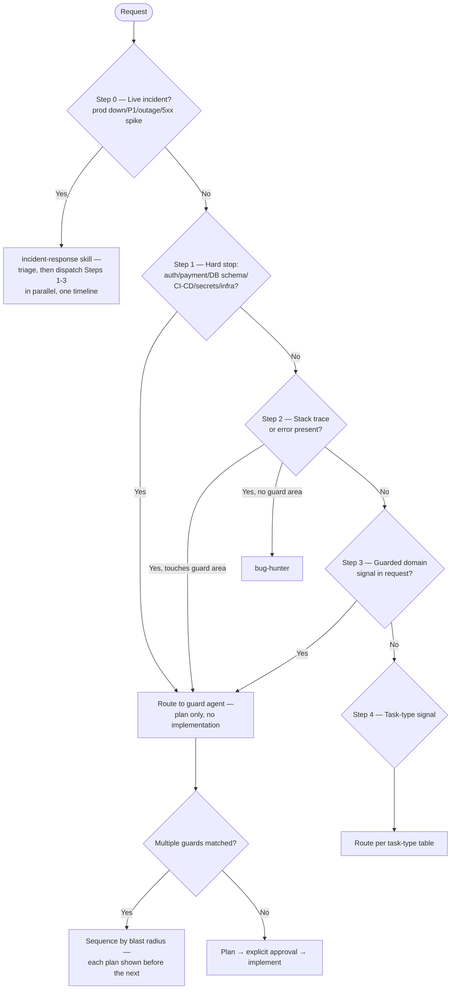

# Agent Routing Decision Tree

Highest-priority signal wins. Read top-to-bottom; stop at the first match.

**Precedence order (memorize this line):** live-incident signal (Step 0) > guard-area noun (Steps 1 and 3) > stack trace (Step 2) > task-type verb (Step 4). Step 0 outranks everything else because it doesn't pick an agent — it decides whether Steps 1-3 run as one coordinated, parallel dispatch instead of a single sequential match. A guard-area noun outranks every other remaining signal whenever the request **changes that guarded surface** — "fix CSS in the login form" is security-guard territory, not ui-fixer. A request that only *references* a guarded area without touching its code (writing tests against it, documenting it, researching it) routes by task type instead. Ties between two guard areas are resolved by blast radius (see "Multiple guard signals"); ties between non-guard signals by the [Conflict resolution](#conflict-resolution--when-two-signals-match) table.

The same logic as a flowchart — the tables below are the source of truth, this is a reading aid:



---

## Step 0 — Live incident check (before everything else)

"Prod is down" / "P1" / "outage" / "5xx spike" / "users can't log in right now" — anything reporting
a *live* incident rather than a routine bug, even one carrying a stack trace or an obvious guard-area
noun — routes to the `incident-response` skill first, not straight to bug-hunter or a single guard.
It has no `Agent` tool, so it triages severity/blast-radius and produces a dispatch plan for the
same Step 1/3 guards below; the calling agent/orchestrator then actually invokes them (in parallel
where safe) and keeps one timeline for the postmortem. This check runs *before* Step 1 because it
doesn't compete with the hard-stop/guard-area/stack-trace signals below — it decides whether they
run as one coordinated dispatch instead of picking among them.

---

## Step 1 — Hard stop check (always first, after Step 0)

Does the request touch any of `global-CLAUDE.md`'s HARD STOPS nouns (auth, payment, DB schema,
CI/CD, secrets, infrastructure — see that section, already loaded every session, for the exact
list; not restated here so the two copies can't drift)?

**YES →** Do NOT route to any implementation agent.
Route directly to the appropriate guard (see Step 3) and produce a plan only.

---

## Step 2 — Error / crash signal

Is a stack trace or error message present?

```text
YES → bug-hunter (no clarification needed — read trace, fix, test)
      EXCEPTION: if trace touches auth/payment/DB schema → escalate to guard (Step 3)
      EXCEPTION: if the report also carries live-incident language (see Step 0) → incident-response skill, not bug-hunter directly
NO  → continue to Step 3
```

---

## Step 3 — Domain signal (guarded areas)

| Signal in the request | Agent | Tier |
| --- | --- | --- |
| auth / session / JWT / OAuth / login / logout | security-guard | 3 |
| payment / billing / invoice / subscription | security-guard | 3 |
| injection / XSS / CSRF / CVE / vulnerability | security-guard | 3 |
| DB schema / model / column / index / constraint | db-guard | 3 |
| migration / ALTER TABLE / DROP / data backfill | db-guard | 3-4 |
| CI/CD / GitHub Actions / Docker / Terraform / K8s | devops-guard | 3-4 |

Guard agents are **read-only planners** — they produce a written plan and pause for approval.
Implementation only starts after explicit user approval ("looks good", "proceed", "yes").

### Multiple guard signals in one request

When a request matches more than one row in the Step 3 table (e.g. "add an encrypted-token column" = auth + DB schema), route to **all** matching guards, sequenced by blast radius — widest-impact guard plans first, narrower guard reviews its slice before implementation:

```text
auth/payment + DB schema   → security-guard (data classification, encryption-at-rest) → db-guard
auth/payment + CI/CD       → security-guard (secrets, auth flow) → devops-guard
DB schema + CI/CD          → db-guard → devops-guard (deploy ordering)
```

Each guard's plan is shown before the next guard starts — never skip straight to implementation because one guard approved.

### db-guard runs both DB review phases

db-guard covers schema design AND migration deployment safety in one agent (two output modes):

```text
User: "add a column to users" / "add an index" (additive, GO-tier)
  → db-guard (schema design: additive-first, index analysis, risk classification
              + deployment safety: deploy order, rollback procedure, zero-downtime staging)
        → senior-engineer (implements only after the plan is approved)

User: "drop the legacy_status column" (destructive, STOP-tier — needs explicit user approval + verified backup)
  → db-guard (schema design flags it STOP + deployment safety spells out the rollback/backup requirement)
        → user approval required before senior-engineer implements

User: "review this migration file" (migration exists, no schema-design question)
  → db-guard, deployment-safety mode only (MIGRATION SAFETY REVIEW output)
```

---

## Step 4 — Task type signal

No guard area matched. What kind of task is it?

```text
CSS / button / modal / copy / animation / layout    → ui-fixer   (haiku,  Tier 0-1)
Bug / error in specific file, no guard area         → bug-hunter (sonnet, Tier 0-2)
Add test / update spec / regression coverage        → test-engineer (sonnet, Tier 1-2)
Review a diff / PR / recent change                  → reviewer   (sonnet, Tier 1-2)
New page / screen / component — pure UI             → ui-fixer   (haiku,  Tier 1-2)
New page needing backend (upload, API, DB)          → senior-engineer (sonnet, Tier 2)
API contract / endpoint design / versioning         → senior-engineer (sonnet, Tier 2-3)
Normal feature, refactor, multi-file work           → senior-engineer (sonnet, Tier 2)
Slow query / N+1 / bundle / render loop             → performance-guard (sonnet, Tier 2-3)
Dep CVE / audit / outdated packages                 → security-guard (scan mode, Tier 1-2)
Large feature / architecture / system design        → architect  (opus,   Tier 3)
New project / greenfield / starting from scratch    → architect (opus, Tier 3) plans; senior-engineer runs `from-scratch`
Research / fact-check / comparison                  → researcher (opus,   Tier 2-3)
README / changelog / API docs                       → docs-writer (haiku, Tier 0-1)
```

---

## Step 5 — Ambiguity resolution

| Confidence | Action |
| --- | --- |
| > 80% | Act — state assumption in one line, then proceed |
| 50–80% | State assumption, proceed, note what to correct |
| < 50% | Ask ONCE with a specific, closed question |

---

## Conflict resolution — when two signals match

| Conflict | Winner | Reason |
| --- | --- | --- |
| Bug in auth code | security-guard (not bug-hunter) | Guard areas always win |
| Feature that needs DB column | db-guard plans first, senior-engineer implements | Schema change requires guard review |
| CSS bug that touches auth session display | security-guard | Auth signal dominates |
| Performance issue in a DB query | performance-guard reads, db-guard if schema change needed | Read-only perf = performance-guard; schema fix = db-guard |
| Refactor touching 6+ files | architect (not senior-engineer) | >5 files = Tier 2 min; large scope = Tier 3 |
| Security scan vs. specific vulnerability fix | security-guard both — tool-driven scan mode for audits, code-review mode for fixes | Scan ≠ fix, but one agent owns both modes |
| Docs update that changes API contract | senior-engineer or architect first; docs-writer after | Contract change precedes docs |
| "Review my auth/payment/DB/CI code" (review verb + guard-area noun) | The matching Step 3 guard, not reviewer | Guard-area nouns always outrank the generic "review/check" verb — reviewer is for diffs with no guard-area signal |
| "Design the API contract" for one feature/service | senior-engineer (not architect) | architect is for system-wide / multi-system design; a single service's API contract and versioning is Tier 2-3 engineering |
| New page that also needs backend (upload, API, DB) | senior-engineer (not ui-fixer) | ui-fixer is UI-only — anything requiring server/state work starts at senior-engineer instead of escalating mid-task |
| Refactor with no behavior change | senior-engineer (not bug-hunter) | Nothing is broken — bug-hunter needs an error/regression signal; behavior-preserving restructuring is normal engineering |
| Write tests for auth/payment/DB code | test-engineer (not the guard) | Tests exercise existing behavior without changing the guarded surface — test-engineer escalates to the guard only if the tests expose a vulnerability |
| System-wide redesign that spans a guarded area (e.g. the whole checkout flow) | architect (not the guard) | Architecture-scale scope wins the entry point; the matching guards then review their slices of architect's plan before implementation (see "Multiple guard signals") |

---

## Escalation chain

```text
ui-fixer
  └─▶ senior-engineer (if backend or state needed)
        └─▶ architect (if scope grows or design ambiguous)
              └─▶ security-guard / devops-guard ─────────────┐
              └─▶ db-guard (schema design + migration deployment safety) ─┤
              └─▶ performance-guard (read-only; reports back, does not implement) ─┤
                                                                └─▶ senior-engineer (implements approved plan)
                                                                      └─▶ reviewer (optional post-implementation check)
```

---

## Natural language triggers (EN + TR)

| Keyword pattern | Routes to |
| --- | --- |
| fix / broke / error / crash / hata / düzelt | bug-hunter |
| add / create / build / implement / ekle / oluştur | senior-engineer |
| refactor / restructure / split / modularize / sadeleştir / böl | senior-engineer |
| design / architecture / plan / tasarla / mimari | architect |
| auth / login / token / session / JWT / güvenlik | security-guard |
| slow / perf / N+1 / bundle / yavaş | performance-guard |
| DB / schema / column / model / tablo | db-guard |
| migrate / migration / ALTER / DROP | db-guard |
| Docker / CI / pipeline / deploy / infra | devops-guard |
| review / check / incele / bak / diff | reviewer |
| test / spec / coverage | test-engineer |
| CSS / button / modal / tailwind / layout | ui-fixer |
| research / find / compare / araştır | researcher |
| README / docs / changelog / belge | docs-writer |
